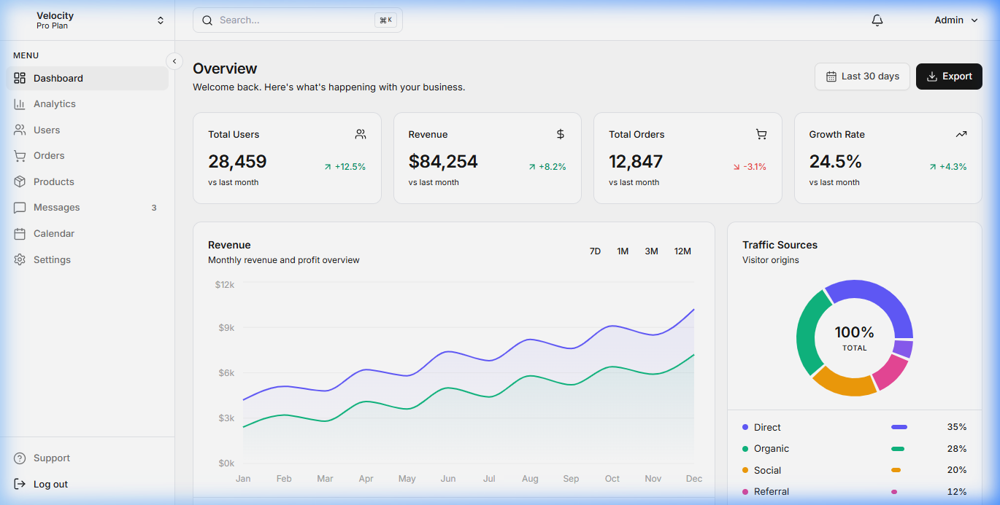
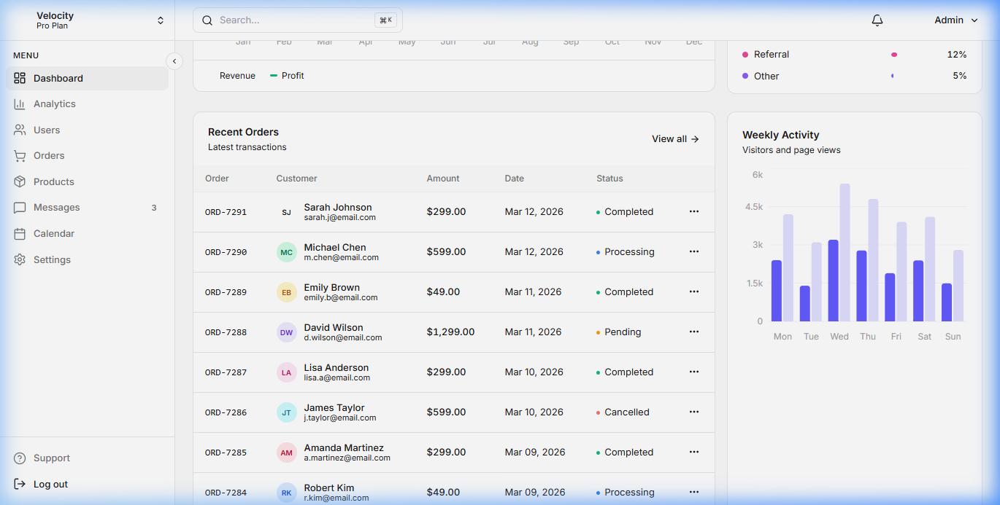
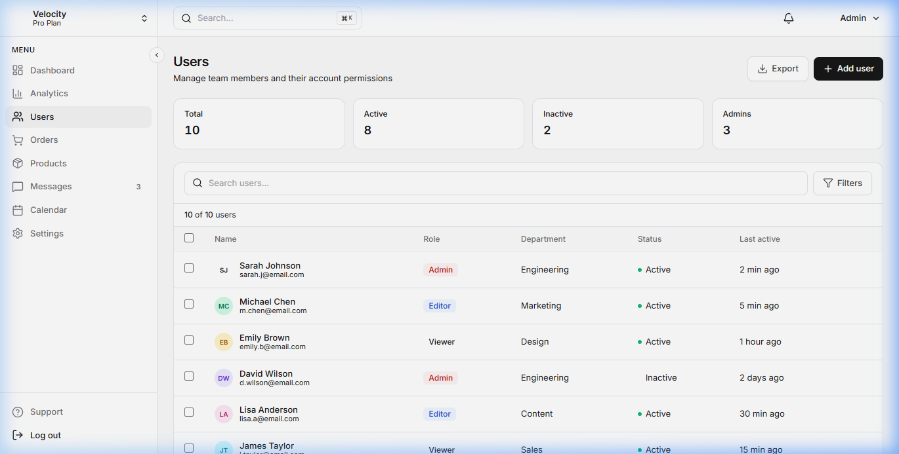

<div align="center">

# ⚡ Velocity — Admin Dashboard

A modern, production-ready **Admin Dashboard** built with **React.js** and **Tailwind CSS**.  
Inspired by the clean, data-focused design language of **Stripe** and **Notion**.

[](https://react.dev/)
[](https://tailwindcss.com/)
[](https://vitejs.dev/)
[](LICENSE)

[Live Demo](#) · [Report Bug](https://github.com/DeepParekh9190/react-admin-dashboard/issues) · [Request Feature](https://github.com/DeepParekh9190/react-admin-dashboard/issues)

</div>

---

## 📸 Screenshots

### Dashboard Overview
> Stats cards, revenue chart, traffic sources, and real-time analytics at a glance.



### Orders & Activity
> Clean data tables with status indicators, pagination, and weekly activity charts.



### User Management
> Search, filter, and manage users with role badges, status tracking, and bulk actions.



---

## ✨ Features

### 🎯 Core Pages
- **Dashboard** — Overview with KPI cards, revenue charts, traffic breakdown, orders table, and weekly activity
- **User Management** — Full CRUD-ready table with search, multi-criteria filters, and role-based badges

### 🧩 Components
| Component | Description |
|-----------|-------------|
| **Collapsible Sidebar** | Smooth expand/collapse with active route indicators and notification badges |
| **Top Navbar** | Global search with `⌘K` shortcut, notification dropdown, and profile menu |
| **Stats Cards** | Animated KPI cards for Users, Revenue, Orders, and Growth with trend arrows |
| **Revenue Chart** | Area chart with revenue/profit lines, gradient fills, and time-period filters |
| **Traffic Sources** | Donut chart with progress bar legend for visitor origin breakdown |
| **Activity Chart** | Bar chart comparing visitors vs page views across the week |
| **Orders Table** | Sortable table with avatars, status dots, monospace IDs, and pagination |
| **Filter System** | Segmented toggle filters for Role, Status, and Department |

### 🎨 Design System
- **Stripe-inspired** neutral color palette with refined surface tones
- **Dark tooltips** on charts for better readability
- **Subtle borders** and shadows — no heavy gradients or glows
- **Inter font family** for clean, professional typography
- **Micro-animations** — fade-in, slide-up, and scale-in transitions
- **Custom scrollbar** styling for a polished feel

### 📱 Responsive
- Fully responsive from mobile to ultra-wide displays
- Mobile sidebar with backdrop overlay
- Stacked card layouts on small screens
- Horizontal scroll for data tables on narrow viewports

---

## 🛠 Tech Stack

| Technology | Purpose |
|:---|:---|
| [React 19](https://react.dev/) | UI library with functional components & hooks |
| [Tailwind CSS 3](https://tailwindcss.com/) | Utility-first CSS framework |
| [Vite 8](https://vitejs.dev/) | Lightning-fast dev server and build tool |
| [Recharts](https://recharts.org/) | Composable charting library for React |
| [Lucide React](https://lucide.dev/) | Beautiful, consistent icon set |
| [React Router v7](https://reactrouter.com/) | Client-side routing |

---

## 🚀 Getting Started

### Prerequisites

- **Node.js** ≥ 18
- **npm** ≥ 9

### Installation

```bash
# Clone the repository
git clone https://github.com/DeepParekh9190/react-admin-dashboard.git

# Navigate into the project
cd react-admin-dashboard

# Install dependencies
npm install

# Start the development server
npm run dev
```

The app will be available at `http://localhost:5173/`

### Build for Production

```bash
npm run build
```

The optimized output will be in the `dist/` directory.

---

## 📁 Project Structure

```
react-admin-dashboard/
├── public/                      # Static assets
├── screenshots/                 # README screenshots
├── src/
│   ├── components/
│   │   ├── dashboard/
│   │   │   ├── ActivityChart.jsx       # Weekly bar chart
│   │   │   ├── RecentOrdersTable.jsx   # Orders data table
│   │   │   ├── RevenueChart.jsx        # Revenue area chart
│   │   │   ├── StatsCard.jsx           # KPI stat card
│   │   │   └── TrafficChart.jsx        # Traffic donut chart
│   │   └── layout/
│   │       ├── DashboardLayout.jsx     # Main layout wrapper
│   │       ├── Navbar.jsx              # Top navigation bar
│   │       └── Sidebar.jsx             # Collapsible sidebar
│   ├── data/
│   │   └── mockData.js                 # Mock API data
│   ├── pages/
│   │   ├── Dashboard/
│   │   │   └── DashboardPage.jsx       # Dashboard page
│   │   └── Users/
│   │       └── UsersPage.jsx           # User management page
│   ├── App.jsx                         # Router configuration
│   ├── App.css
│   ├── index.css                       # Global styles & Tailwind
│   └── main.jsx                        # Entry point
├── .vscode/
│   └── settings.json                   # IDE config for Tailwind
├── index.html
├── tailwind.config.js                  # Tailwind configuration
├── postcss.config.js
├── vite.config.js
└── package.json
```

---

## 🎯 Key Design Decisions

| Decision | Rationale |
|:---|:---|
| **Neutral color palette** | Mirrors Stripe/Notion's professional, non-distracting aesthetic |
| **Dark chart tooltips** | Better contrast and readability over chart content |
| **Status dots over badges** | Cleaner, more scannable in data-dense tables |
| **Segmented filter controls** | Familiar pattern from macOS/iOS for quick toggling |
| **Monospace order IDs** | Easier to read and compare alphanumeric identifiers |
| **Circular avatars with initials** | Works without external image dependencies |
| **CSS-only component classes** | `btn-primary`, `badge-*`, `th-cell` — reusable without JS overhead |

---

## 🗺 Roadmap

- [ ] Dark mode toggle
- [ ] Analytics page with advanced charts
- [ ] Order detail page with timeline
- [ ] Settings page with form validation
- [ ] Real API integration
- [ ] Authentication flow (Login / Register)
- [ ] Role-based access control
- [ ] Export to CSV / PDF
- [ ] Notification system with WebSocket

---

## 🤝 Contributing

Contributions are welcome! Feel free to:

1. **Fork** the repository
2. **Create** a feature branch (`git checkout -b feature/amazing-feature`)
3. **Commit** your changes (`git commit -m 'Add amazing feature'`)
4. **Push** to the branch (`git push origin feature/amazing-feature`)
5. **Open** a Pull Request

---

## 📄 License

This project is licensed under the **MIT License** — see the [LICENSE](LICENSE) file for details.

---

<div align="center">

**Built with ❤️ by [Deep Parekh](https://github.com/DeepParekh9190)**

⭐ Star this repo if you found it helpful!

</div>
